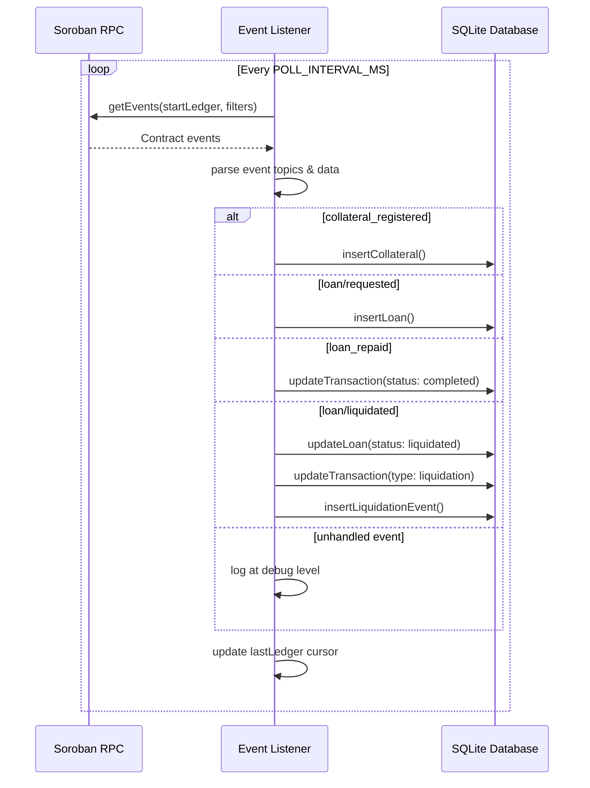

# Contract Event Listener

The contract event listener polls the Soroban RPC for on-chain contract events and synchronises the local backend database. It is defined in [`backend/src/contractEventListener.ts`](../../backend/src/contractEventListener.ts).

---

## Architecture



---

## Polling Interval and Configuration

The listener runs a continuous polling loop. Configuration is via environment variables:

| Variable | Default | Description |
|----------|---------|-------------|
| `RPC_URL` | `https://soroban-testnet.stellar.org` | Soroban JSON-RPC endpoint |
| `CONTRACT_ID` | — | Deployed Soroban contract ID (required, listener skips if unset) |
| `EVENT_POLL_INTERVAL_MS` | `5000` | Time between polls in milliseconds |
| `EVENT_LISTENER_LOG_LEVEL` | `info` | Log level: `debug`, `info`, `warn`, or `error` |

### Lifecycle

- **`startEventListener(intervalMs?)`** — begins the polling loop. The interval defaults to `5000` ms but can be overridden.
- **`stopEventListener()`** — clears the timer and stops polling. Safe to call multiple times.

The listener logs structured startup and shutdown events:
- `event_listener_disabled` — when `CONTRACT_ID` is not set
- `event_listener_started` — on successful start, includes `contractId` and `intervalMs`
- `event_listener_stopped` — on graceful stop

---

## Ledger Cursor Persistence and Replay

The listener tracks the last processed ledger sequence number in a module-level variable (`lastLedger`):

```typescript
let lastLedger = 0;
```

On each poll cycle:

1. **First poll** (`lastLedger === 0`): Issues `getEvents` with `cursor: "0"`, which fetches all historical events for the contract.
2. **Subsequent polls** (`lastLedger > 0`): Issues `getEvents` with `startLedger: lastLedger + 1`, fetching only events after the last processed ledger.

After processing each event, `lastLedger` is updated:

```typescript
if (event.ledger > lastLedger) {
  lastLedger = event.ledger;
}
```

### Replay Behaviour

- **On restart**: `lastLedger` resets to `0`, so the listener fetches all events from the beginning. Events already in the database will cause upserts rather than duplicates (the store functions handle idempotency).
- **No persistent cursor**: The cursor is in-memory only. For persistent cursor tracking across restarts, the cursor would need to be stored in the database.

---

## Event Handling Pipeline

### Event Filtering

Each poll request filters for `type: "contract"` events matching the configured `CONTRACT_ID`:

```typescript
const eventsRequest = {
  startLedger: lastLedger + 1,
  filters: [{ type: "contract", contractIds: [contractId] }],
};
```

### Event Parsing

The `handleEvent` function processes each raw event:

1. **Type check**: Skips non-contract events.
2. **Topic extraction**: Decodes base64-encoded XDR topics into `ScVal` values.
3. **Key derivation**: Combines `topics[0]` (namespace) and `topics[1]` (action) into a key like `"collateral_registered"`, `"loan/requested"`, etc.

---

## Documented Event Types

### 1. `collateral_registered`

**Topics**: `[symbol("collateral_registered"), owner]`

**Data**: `(id: u64, animal_type: Symbol, count: u32, appraised_value: i128)`

**DB action**: `insertCollateral({ id, owner, animal_type, count, appraised_value })`

Inserts a new collateral record. See [events.md §1](../protocol/events.md#1-livestock--registered) for the full schema.

### 2. `loan/requested`

**Topics**: `[symbol("loan"), symbol("requested")]`

**Data**: `(loan_id: u64, borrower: Address, amount: i128, disbursement: i128, total_collateral_value: i128)`

**DB action**: `insertLoan({ id, borrower, collateral_id: "", amount })`

Creates a loan record in the database. See [events.md §2](../protocol/events.md#2-loan--requested) for the full schema.

### 3. `loan_repaid`

**Topics**: `[symbol("loan_repaid"), borrower: Address]`

**Data**: `(loan_id: u64, principal_paid: i128, interest_paid: i128, remaining_balance: i128)`

**DB action**: `updateTransaction(id, { status: "completed", amount: repayAmount })` where `repayAmount = principalPaid + interestPaid`

Marks the transaction as completed. See [events.md §3](../protocol/events.md#3-loan_repaid) for the full schema.

### 4. `loan/liquidated`

**Topics**: `[symbol("loan"), symbol("liquidated")]`

**Data**: `(loan_id: u64, repay_amount: i128, collateral_seized: i128, outstanding: i128, status: Symbol)`

**DB actions**:
1. `updateLoan(id, { status: "liquidated" })` — marks the loan as liquidated
2. `updateTransaction(id, { status: "completed", type: "liquidation" })` — records the liquidation transaction
3. `insertLiquidationEvent({ loan_id, liquidator, repay_amount })` — stores the liquidation event for audit

See [events.md §4](../protocol/events.md#4-loan--liquidated) for the full schema.

---

## Unhandled Events

The following event types are received but **not persisted** to the database. They are logged at `debug` level only:

| Event Key | Description |
|-----------|-------------|
| `FeeCol/*` | Fee collection events |
| `fee/cfgUpd` | Fee configuration updates |
| `whitelist/*` | Liquidator whitelist changes |
| `upgrade/*` | Contract upgrade events |
| `TWAP/price` | TWAP price updates |
| `Pause` / `Unpause` | Contract pause state changes |
| `StaleThr` | Stale threshold events |
| `Admin/*` | Admin configuration changes |
| `collat/appraised` | Appraisal updates |

Full schemas for all unhandled events are documented in [events.md](../protocol/events.md) sections §5–§23.

---

## Structured Logging

Every event processing step produces a structured log entry validated against a Zod schema:

```typescript
const eventLogSchema = z.object({
  timestamp: z.string().datetime(),
  eventType: z.string().min(1),
  contractId: z.string().min(1),
  ledger: z.number().int().nonnegative(),
  correlationId: z.string().min(1),
  context: z.record(z.string(), z.unknown()).optional(),
  error: z.object({
    message: z.string().min(1),
    stack: z.string().optional(),
  }).optional(),
});
```

### Log Event Types

| `eventType` | Meaning |
|-------------|---------|
| `contract.event.received` | A raw event was received from the RPC |
| `contract.event.collateral_synced` | Collateral record inserted/updated |
| `contract.event.loan_synced` | Loan record created |
| `contract.event.loan_repaid_synced` | Repayment transaction recorded |
| `contract.event.loan_liquidated_synced` | Liquidation event recorded |
| `contract.event.parse_error` | Error parsing an event |
| `contract.event.poll_error` | Error during RPC polling |

Correlation IDs are derived from the event's `id` field, with a fallback to `ledger-{ledger}` if no ID is present.

---

## Error Handling

- **Parse errors**: Caught in `handleEvent()` and logged as `contract.event.parse_error`. These do not crash the listener.
- **RPC errors**: Caught in `poll()` and logged as `contract.event.poll_error`. The listener continues to the next poll cycle.
- **Missing `CONTRACT_ID`**: The listener logs a warning and exits immediately without starting.
- All errors are wrapped in the structured log entry's `error` field with message and stack trace.

---

## Testing

Unit tests are in [`backend/src/contractEventListener.test.ts`](../../backend/src/contractEventListener.test.ts). They use mocked RPC responses and verify:

- Start/stop lifecycle
- Event parsing for each handled event type
- DB store function invocations with correct arguments
- Idempotent stop
- Structured log schema compliance
- Error logging behaviour

Run tests with:

```bash
cd backend && npm test -- --testPathPattern=contractEventListener
```

---

## Related

- [events.md](../protocol/events.md) — full typed schemas for all contract events
- [contractEventListener.ts](../../backend/src/contractEventListener.ts) — source code
- [contractEventListener.test.ts](../../backend/src/contractEventListener.test.ts) — unit tests
- [Backend README](../../backend/README.md)
