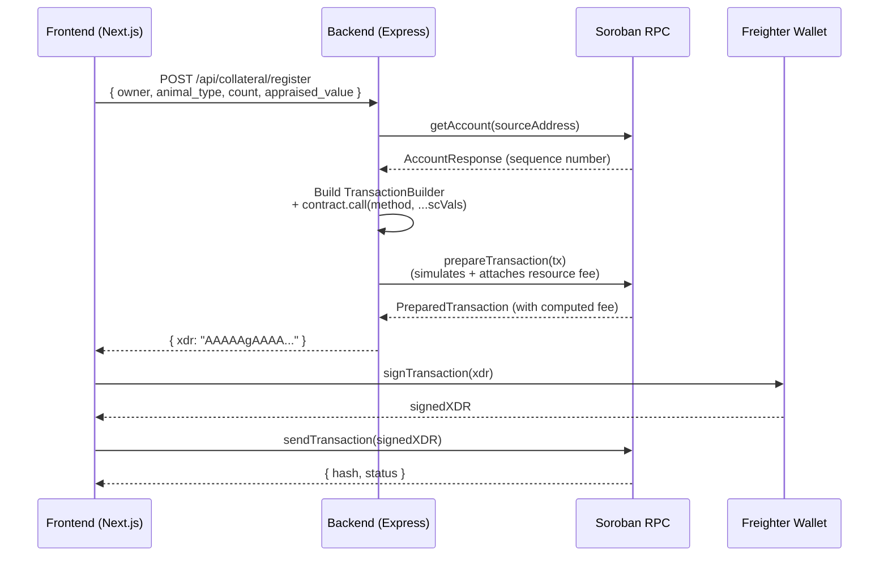

# XDR Transaction Building Guide

This document explains how the StellarKraal backend builds, simulates, and returns signed-ready
Soroban transaction XDR to the frontend. It covers the full flow from request to submission,
including the key SDK types involved.

---

## Overview

StellarKraal uses a **backend-builds, frontend-signs** pattern for Soroban contract interactions:

1. The frontend sends a REST request to the backend with the relevant parameters.
2. The backend builds a Soroban transaction, simulates it to compute the correct resource fee, and
   returns the prepared XDR string.
3. The frontend prompts the user to sign the XDR with Freighter.
4. The signed XDR is submitted to the Soroban RPC.

This separation keeps secret keys out of the backend and lets the user's wallet authorise every
on-chain action.

---

## Sequence Diagram



---

## Core Function: `buildContractTx`

Located in `backend/src/index.ts`, this helper is used by every state-mutating route.

```typescript
async function buildContractTx(
  sourceAddress: string,
  method: string,
  args: xdr.ScVal[]
): Promise<string> {
  // 1. Fetch the account to get the current sequence number
  const account = await rpcClient.getAccount(sourceAddress);

  // 2. Create a Contract instance from the configured CONTRACT_ID
  const contract = new Contract(CONTRACT_ID);

  // 3. Build the transaction envelope
  const tx = new TransactionBuilder(account, {
    fee: BASE_FEE,                    // Stellar base fee (100 stroops)
    networkPassphrase: NETWORK_PASSPHRASE, // Testnet or Mainnet
  })
    .addOperation(contract.call(method, ...args))  // Soroban contract invocation
    .setTimeout(30)                   // 30-second validity window
    .build();

  // 4. Simulate the transaction to compute the correct Soroban resource fee
  try {
    const prepared = await rpcClient.prepareTransaction(tx);
    return prepared.toXDR();          // Return base64-encoded XDR string
  } catch (err) {
    throw mapSorobanError(err);       // Translate Soroban error codes to HTTP errors
  }
}
```

### Step-by-step breakdown

| Step | What happens |
|------|-------------|
| `rpcClient.getAccount(sourceAddress)` | Fetches the account object from Soroban RPC. Contains the current sequence number, which must be incremented for every transaction. |
| `new Contract(CONTRACT_ID)` | Creates a helper that knows the contract's address and can build `InvokeHostFunctionOp` operations. |
| `new TransactionBuilder(account, { fee, networkPassphrase })` | Initialises the transaction envelope. `BASE_FEE` (100 stroops) is the minimum; `prepareTransaction` will raise it to cover Soroban resource costs. |
| `.addOperation(contract.call(method, ...args))` | Appends a single `InvokeHostFunctionOp` that calls `method` on the contract with the given `ScVal` arguments. |
| `.setTimeout(30)` | Sets the transaction's valid-until time to `now + 30 seconds`. Transactions are rejected by the network after this window. |
| `rpcClient.prepareTransaction(tx)` | Calls `simulateTransaction` on the RPC node. The simulation calculates CPU and memory resources, then attaches the computed `sorobanData` and resource fee to the transaction. The returned `prepared` object is the final unsigned transaction. |
| `prepared.toXDR()` | Serialises the transaction to a base64-encoded XDR string ready for signing. |

---

## Argument Encoding: `nativeToScVal`

Soroban contract functions accept `ScVal` (Smart Contract Value) arguments. The
`@stellar/stellar-sdk` provides `nativeToScVal` to convert JavaScript values:

```typescript
import { nativeToScVal, Address, xdr } from '@stellar/stellar-sdk';

// Address (Stellar public key → AccountId ScVal)
new Address(owner).toScVal()

// Symbol (contract enum or string symbol)
nativeToScVal(animal_type, { type: 'symbol' })

// u32 integer
nativeToScVal(count, { type: 'u32' })

// i128 integer (large values; must be BigInt in JS)
nativeToScVal(BigInt(appraised_value), { type: 'i128' })

// u64 integer
nativeToScVal(BigInt(loan_id), { type: 'u64' })

// Optional / void
xdr.ScVal.scvVoid()
```

### Encoding examples per endpoint

#### `POST /api/collateral/register` → `register_livestock`

```typescript
[
  new Address(owner).toScVal(),                          // owner: Address
  nativeToScVal(animal_type, { type: 'symbol' }),        // animal_type: Symbol
  nativeToScVal(count, { type: 'u32' }),                 // count: u32
  nativeToScVal(BigInt(appraised_value), { type: 'i128' }), // appraised_value: i128
]
```

#### `POST /api/loan/request` → `request_loan`

```typescript
[
  new Address(borrower).toScVal(),                       // borrower: Address
  nativeToScVal(BigInt(collateral_id), { type: 'u64' }), // collateral_id: u64
  nativeToScVal(BigInt(amount), { type: 'i128' }),       // amount: i128
  min_disbursement
    ? nativeToScVal(BigInt(min_disbursement), { type: 'i128' })
    : xdr.ScVal.scvVoid(),                               // min_disbursement: Option<i128>
]
```

#### `POST /api/loan/repay` → `repay_loan`

```typescript
[
  new Address(borrower).toScVal(),                       // borrower: Address
  nativeToScVal(BigInt(loan_id), { type: 'u64' }),       // loan_id: u64
  nativeToScVal(BigInt(amount), { type: 'i128' }),       // amount: i128
]
```

#### `POST /api/loan/liquidate` → `liquidate_loan`

```typescript
[
  new Address(borrower).toScVal(),                       // borrower: Address
  nativeToScVal(BigInt(loan_id), { type: 'u64' }),       // loan_id: u64
  nativeToScVal(BigInt(amount), { type: 'i128' }),       // amount: i128
]
```

---

## Simulation for Read-Only Calls

Read-only contract functions (e.g. `get_loan`, `health_factor`) do not need to be signed.
The backend calls `rpcClient.simulateTransaction` directly and reads the return value from
`result.retval`:

```typescript
const tx = new TransactionBuilder(account, { fee: BASE_FEE, networkPassphrase })
  .addOperation(contract.call('get_loan', nativeToScVal(BigInt(loan_id), { type: 'u64' })))
  .setTimeout(30)
  .build();

const result = await rpcClient.simulateTransaction(tx);
const retval = (result as any).result?.retval;
// retval is an xdr.ScVal — decode with scValToNative(retval)
```

`scValToNative` converts the Soroban return value back to a JavaScript-native type (number,
bigint, object, etc.).

---

## How the Frontend Signs and Submits

After receiving the XDR from the backend, the frontend:

1. Calls `signTransaction(xdr, { network: 'TESTNET' | 'PUBLIC' })` via the Freighter API.
2. Receives the signed XDR back from Freighter.
3. Submits the signed XDR to the Soroban RPC using `server.sendTransaction(signedXdr)`.
4. Polls `server.getTransaction(hash)` until the transaction is confirmed or fails.

The backend never sees the user's private key at any point.

---

## Error Handling

`mapSorobanError` (in `backend/src/utils/sorobanErrors.ts`) translates Soroban contract error
codes to readable HTTP responses. Common error scenarios:

| Soroban error | Likely cause |
|---|---|
| `Error::InsufficientCollateral` | Requested loan amount exceeds the LTV-allowed maximum. |
| `Error::CollateralNotFound` | Invalid collateral ID passed to the contract. |
| `Error::LoanAlreadyClosed` | Attempted operation on a repaid or liquidated loan. |
| `Error::ContractPaused` | The contract has been administratively paused. |
| `Error::Unauthorized` | The `sourceAddress` does not match the expected party. |

See [Smart Contract Interface](../contracts/stellarkraal-interface.md) and
[API Error Code Reference](../api-error-codes.md) for the full list.

---

## Configuration

| Environment variable | Description | Example |
|---|---|---|
| `CONTRACT_ID` | Deployed Soroban contract address | `CDLZFC3SYJYDZT7K67VZ75HPJVIEUVNIXF47ZG2FB2RMQQVU2HHGCYSC` |
| `NEXT_PUBLIC_NETWORK` | `testnet` or `mainnet` — selects network passphrase | `testnet` |
| `RPC_URL` | Soroban JSON-RPC endpoint | `https://soroban-testnet.stellar.org` |

These are validated at startup via `backend/src/config.ts`.

---

## Related Documents

- [Smart Contract Interface](../contracts/stellarkraal-interface.md) — full contract ABI
- [API Error Code Reference](../api-error-codes.md) — HTTP and contract error codes
- [ADR-001 — Use Soroban](../adr/ADR-001-soroban.md) — rationale for Soroban
- [Stellar SDK docs](https://stellar.github.io/js-stellar-sdk/)
