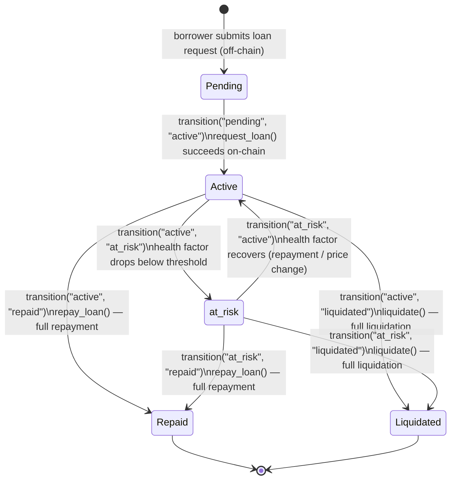

# Loan State Machine

This document describes every state a StellarKraal loan can be in, the valid transitions between states, the triggering function names, and the errors thrown for invalid transitions.

---

## State Diagram



> **Note:** `Pending` is an off-chain state managed by the backend only. All other states (`Active`, `at_risk`, `Repaid`, `Liquidated`) map to on-chain `LoanStatus` variants and are also represented in the backend state machine.

---

## States

### `Pending`

**Layer:** off-chain (backend database only)

The loan request has been submitted by the borrower via the backend API but the `request_loan` contract call has not yet been confirmed on-chain. Collateral is reserved in the backend but not yet locked on-chain.

**Invariants:**
- No on-chain `LoanRecord` exists yet.
- Collateral records are not yet locked (`loan_id == 0` on-chain).
- The loan has no `loan_id` assigned on-chain.

---

### `Active`

**Layer:** on-chain (`LoanStatus::Active`)

The loan is open. An on-chain `LoanRecord` exists with `outstanding > 0`. Collateral is locked to this loan. Repayments and liquidations are accepted.

**Invariants:**
- `outstanding > 0`
- All referenced collateral records have `loan_id` set to this loan's ID.
- Borrower can call `repay_loan`; liquidators can call `liquidate` if `HF < 10_000`.
- Repayment is **not** blocked when the contract is paused; new loans and liquidations are.

---

### `at_risk`

**Layer:** on-chain (`LoanStatus::AtRisk`)

The loan's health factor has fallen below the warning threshold but is still above the liquidation threshold. The loan is still active but flagged for close monitoring.

**Invariants:**
- `outstanding > 0`
- `HF < health_factor_warning_threshold`
- `HF >= liquidation_threshold`
- Borrower can still repay; liquidators **cannot** liquidate until HF drops below liquidation threshold.
- Can transition back to `Active` if health factor recovers.

---

### `Repaid`

**Layer:** on-chain (`LoanStatus::Repaid`)

The borrower has paid the full outstanding balance. This is a terminal state.

**Invariants:**
- `outstanding == 0`
- No further repayments or liquidations are accepted (`LoanAlreadyClosed` error).
- Collateral records are released (can be used in a new loan).

---

### `Liquidated`

**Layer:** on-chain (`LoanStatus::Liquidated`)

The loan was fully closed through the liquidation mechanism. This is a terminal state.

**Invariants:**
- `outstanding == 0`
- No further repayments or liquidations are accepted (`LoanAlreadyClosed` error).
- Collateral transfer to the liquidator is handled off-chain via oracle settlement.

---

## Valid Transitions

| From | To | Backend Function | On-Chain Trigger | Condition |
|---|---|---|---|---|
| _(none)_ | `Pending` | — | Borrower submits loan request to backend API | Contract not paused; collateral unlocked |
| `Pending` | `Active` | `transition("pending", "active")` | `request_loan()` confirmed on-chain | `amount <= total_collateral_value × LTV / 10_000`; borrower auth; collateral owned by borrower |
| `Active` | `at_risk` | `transition("active", "at_risk")` | Health factor drops below warning threshold (off-chain job) | `HF < warning_threshold` |
| `at_risk` | `Active` | `transition("at_risk", "active")` | Health factor recovers (repayment / price change) | `HF >= warning_threshold` |
| `Active` | `Repaid` | `transition("active", "repaid")` | `repay_loan()` — full | `repay_amount >= outstanding`; borrower auth |
| `Active` | `Liquidated` | `transition("active", "liquidated")` | `liquidate()` — full | `HF < 10_000`; `outstanding` reaches 0 |
| `at_risk` | `Repaid` | `transition("at_risk", "repaid")` | `repay_loan()` — full | `repay_amount >= outstanding`; borrower auth |
| `at_risk` | `Liquidated` | `transition("at_risk", "liquidated")` | `liquidate()` — full | `HF < 10_000`; `outstanding` reaches 0 |

### Helper Function

**`allowedTransitions(status)`** returns all valid next states for a given status:
- `allowedTransitions("pending")` → `["active"]`
- `allowedTransitions("active")` → `["repaid", "liquidated", "at_risk"]`
- `allowedTransitions("at_risk")` → `["repaid", "liquidated", "active"]`
- `allowedTransitions("repaid")` → `[]` (terminal)
- `allowedTransitions("liquidated")` → `[]` (terminal)

---

## Invalid Transitions

The backend function `transition(current, next, history)` throws an `InvalidTransitionError` when an invalid transition is attempted. The error message follows the format:

```
Invalid loan transition: {from} → {to}
```

| From | To | Behaviour |
|---|---|---|
| `pending` | `repaid` | `InvalidTransitionError` |
| `pending` | `liquidated` | `InvalidTransitionError` |
| `pending` | `pending` | `InvalidTransitionError` |
| `active` | `pending` | `InvalidTransitionError` |
| `active` | `active` | `InvalidTransitionError` |
| `repaid` | `active` | `InvalidTransitionError` |
| `repaid` | `liquidated` | `InvalidTransitionError` |
| `repaid` | `pending` | `InvalidTransitionError` |
| `repaid` | `at_risk` | `InvalidTransitionError` |
| `repaid` | `repaid` | `InvalidTransitionError` |
| `liquidated` | `active` | `InvalidTransitionError` |
| `liquidated` | `repaid` | `InvalidTransitionError` |
| `liquidated` | `pending` | `InvalidTransitionError` |
| `liquidated` | `at_risk` | `InvalidTransitionError` |
| `liquidated` | `liquidated` | `InvalidTransitionError` |
| `at_risk` | `pending` | `InvalidTransitionError` |
| `at_risk` | `at_risk` | `InvalidTransitionError` |

Error type: `InvalidTransitionError extends Error`

```typescript
export class InvalidTransitionError extends Error {
  constructor(from: LoanStatus, to: LoanStatus) {
    super(`Invalid loan transition: ${from} → ${to}`);
    this.name = "InvalidTransitionError";
  }
}
```

**Note:** The history array is **not** mutated when an invalid transition is attempted.

---

## Implementation

The state machine is implemented in the backend at [`backend/src/loanStateMachine.ts`](../../backend/src/loanStateMachine.ts):

- **`transition(current, next, history)`** — validates the transition, appends a `TransitionRecord` to history, returns the new status.
- **`allowedTransitions(status)`** — returns the array of valid next states.
- **`InvalidTransitionError`** — thrown for invalid transitions.
- **`TransitionRecord`** — `{ from: LoanStatus, to: LoanStatus, at: string }` with ISO timestamp.

The valid transition matrix is defined as a constant:

```typescript
const TRANSITIONS: Record<LoanStatus, LoanStatus[]> = {
  pending: ["active"],
  active: ["repaid", "liquidated", "at_risk"],
  at_risk: ["repaid", "liquidated", "active"],
  repaid: [],
  liquidated: [],
};
```

---

## On-Chain Events

Each transition emits a Soroban contract event. See [events.md](events.md) for full field definitions.

| Transition | Event topics | Key fields |
|---|---|---|
| `Pending` → `Active` | `("loan", "requested")` | `loan_id`, `borrower`, `amount`, `disbursement`, `total_collateral_value` |
| `Active` → `Active` (partial repay) | `("loan", "repaid")` | `loan_id`, `repay_amount`, `outstanding`, `status: Active` |
| `Active` → `Repaid` | `("loan", "repaid")` | `loan_id`, `repay_amount`, `outstanding: 0`, `status: Repaid` |
| `Active` → `Active` (partial liquidation) | `("loan", "liquidated")` | `loan_id`, `liquidator`, `repay_amount`, `outstanding`, `status: Active` |
| `Active` → `Liquidated` | `("loan", "liquidated")` | `loan_id`, `liquidator`, `repay_amount`, `outstanding: 0`, `status: Liquidated` |

---

## Related

- Smart contract: [`contracts/stellarkraal/src/lib.rs`](../../contracts/stellarkraal/src/lib.rs)
- Backend state machine: [`backend/src/loanStateMachine.ts`](../../backend/src/loanStateMachine.ts)
- State machine tests: [`backend/src/loanStateMachine.test.ts`](../../backend/src/loanStateMachine.test.ts)
- Liquidation mechanics: [liquidation.md](liquidation.md)
- Contract events reference: [events.md](events.md)
